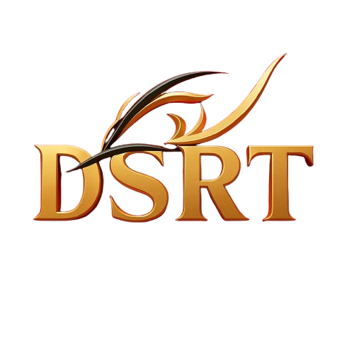

<h1 align="center">DSRT Browser 🦊</h1>

<p align="center">
  A modern, lightweight, and customizable Chromium-based browser built with <a href="https://www.electronjs.org/">Electron</a>.
</p>

<p align="center">
  
</p>

<p align="center">
  <!-- Release & Build -->
  <a href="https://github.com/dsrtartweb10-prog/my-full-browser/releases">
    
  </a>
  <a href="https://github.com/dsrtartweb10-prog/my-full-browser/actions">
    
  </a>
  

  <!-- Repo Stats -->
  <a href="https://github.com/dsrtartweb10-prog/my-full-browser/stargazers">
    
  </a>
  <a href="https://github.com/dsrtartweb10-prog/my-full-browser/network/members">
    
  </a>
  <a href="https://github.com/dsrtartweb10-prog/my-full-browser/issues">
    
  </a>
  <a href="https://github.com/dsrtartweb10-prog/my-full-browser/pulls">
    
  </a>

  <!-- License & Downloads -->
  <a href="LICENSE">
    
  </a>
  <a href="https://github.com/dsrtartweb10-prog/my-full-browser/releases">
    
  </a>
</p>

---

## ✨ Features
- 🗂️ **Tabbed Browsing**
- ⭐ **Bookmarks**
- 🕘 **History**
- ⬇️ **Download Manager**
- 🔄 **Auto-update**
- 🖥️ **Cross-platform** (Windows, macOS, Linux)

---

## 📦 Quick Install
👉 [**Download Latest Release**](https://github.com/dsrtartweb10-prog/my-full-browser/releases)

- **Windows**: `.exe` installer  
- **macOS**: `.dmg` package  
- **Linux**: `.AppImage`  

---

## 🚀 Development

```bash
git clone https://github.com/dsrtartweb10-prog/my-full-browser.git
cd my-full-browser
npm install
npm start

To build installers:

npm run dist


---

📸 Screenshots


---

📚 Documentation

User Guide

Developer Guide

Build & Release Guide


---

🔒 Legal

MIT License

Privacy Policy

End-User License Agreement (EULA)


---

🤝 Contributing

See CONTRIBUTING.md.


---

<p align="center">
  Built with ❤️ by <a href="https://github.com/dsrtartweb10-prog">dsrtartweb10-prog</a>
</p>
```
